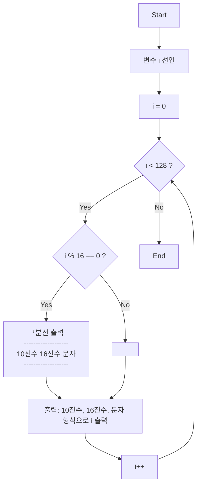

```mermaid
flowchart TD
    A[Start] --> B[변수 i 선언]
    B --> C[i = 0]
    C --> D{ i < 128 ? }

    D -->|Yes| E{ i % 16 == 0 ? }
    E -->|Yes| F[구분선 출력<br>-------------------<br>10진수 16진수 문자<br>-------------------]
    E -->|No| G[ ]

    F --> H[출력: 10진수, 16진수, 문자 형식으로 i 출력]
    G --> H
    H --> I[i++]
    I --> D

    D -->|No| Z[End]

```